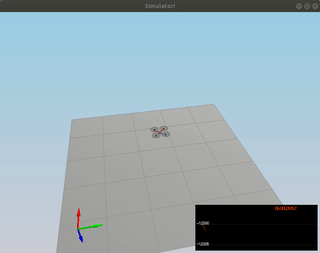
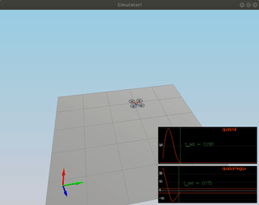
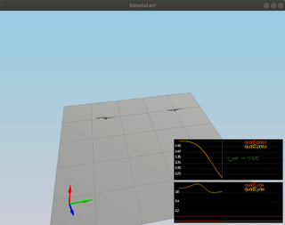
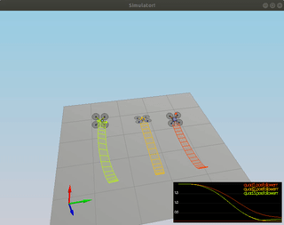

[](https://www.udacity.com/course/flying-car-nanodegree--nd787) **[Controls Project](https://github.com/scifiswapnil/Udacity-Autonomous-Flight-Engineer/tree/main/Control-Project)**

This is the Controls project submission and you are reading the writeup for the project.

---

## **1:** Implemented body rate control in C++. 

The body rate controller takes as input the p_c,q_c,r_c commands. It returns the desired 3 rotational moment commands and uses the required p,q,r gains. The CPP implementation is given below:

```cpp
    V3F momentCmd;
    V3F error = pqrCmd - pqr;
    V3F ubar = kpPQR * error;
    V3F moments = ubar * V3F(Ixx,Iyy,Izz);
```
The controller takes into account the moments of inertia, Ix,Iy and Iz.

---

## **2:** Implement roll pitch control in C++.

I implemented the roll pitch controller in C++ as follows:

```cpp
    float b_x_a = R(0,2);
    float b_y_a = R(1,2);
    float R33 = R(2,2);
    float R21 = R(1,0);
    float R22 = R(1,1);
    float R12 = R(0,1);
    float R11 = R(0,0);
    float b_x_c_target = CONSTRAIN(accelCmd[0]*mass/(collThrustCmd),-maxTiltAngle, maxTiltAngle);
    float b_y_c_target = CONSTRAIN(accelCmd[1]*mass/(collThrustCmd),-maxTiltAngle, maxTiltAngle);

    if (collThrustCmd < 0)
    {
        b_x_c_target = 0;
        b_y_c_target = 0;
    }

    float b_dot_x_c = kpBank*(b_x_c_target - b_x_a);
    float b_dot_y_c = kpBank*(b_y_c_target - b_y_a);
    
    float p_c = (1/R33)*(R21*b_dot_x_c - R11*b_dot_y_c);
    float q_c = (1/R33)*(R22*b_dot_x_c - R12*b_dot_y_c);

    pqrCmd.x = p_c;
    pqrCmd.y = q_c;
```
It takes a thrust command, x and y accelerations and the attitude of the drone (φ,ψ,θ) and outputs the p and q commands. `p_c`, `q_c`. As you can see from the implementation the mass of the drone is accounted when calculating the target angles.Also, the controller accounts for the non-linear transformation from local accelerations to body rates.

---

## **3:** Implement altitude controller in C++.

The altitude control ensures that the vehicle stayes close to the commanded set position and velocity by computing a thrust value. The output thrust is sent to the roll pitch controller. Because the commanded thrust is going to be shared across all dimensions. The portion that points in the x,y will determine acceleration in those directions.
The drone's mass is accounted for and also the non linear effects from non-zero pitch angels as before. Also, I have added the term `integratedAltitudeError` to handle the weight non-idealities.

```cpp
    float b_z = R(2,2);
    
    velZCmd = -CONSTRAIN(-velZCmd,-maxDescentRate,maxAscentRate);
    float e = posZCmd - posZ;
    integratedAltitudeError += KiPosZ*e*dt;

    float u_bar_1 = kpPosZ*(posZCmd - posZ) + kpVelZ*(velZCmd - velZ) + accelZCmd + integratedAltitudeError;
    float accelZ = (u_bar_1 - 9.81f)/b_z;
    if (accelZ > 0){
        accelZ = 0;
    }
    
        thrust = -accelZ*mass;

```
---

## **4:** Implement lateral position control in C++.

This controller is a PD controller in the x and y trajectories. In generates an acceleration commandin the x-y directions which is sent to the roll pitch controller.

The controller uses the local NE position and velocity, `local_position_cmd` and `local_velocity_cmd` and it generates the commanded acceleration below. The negative sign shows that the position is in NE.


```cpp
    V3F desAccel;
    
    accelCmd[0] = CONSTRAIN(accelCmd[0], -maxAccelXY, maxAccelXY);
    accelCmd[1] = CONSTRAIN(accelCmd[1], -maxAccelXY, maxAccelXY);
    
    velCmd[0] = CONSTRAIN(velCmd[0], -maxSpeedXY,maxSpeedXY);
    velCmd[1] = CONSTRAIN(velCmd[1], -maxSpeedXY,maxSpeedXY);

    desAccel.x = kpPosXY*(posCmd[0] - pos[0]) + kpVelXY*(velCmd[0] - vel[0]) + accelCmd[0];
    desAccel.y = kpPosXY*(posCmd[1] - pos[1]) + kpVelXY*(velCmd[1] - vel[1]) + accelCmd[1];
    
    desAccel.x = -desAccel.x;//CONSTRAIN(desAccel.x, -maxAccelXY, maxAccelXY);
    desAccel.y = -desAccel.y;//CONSTRAIN(desAccel.y, -maxAccelXY, maxAccelXY);
    desAccel.x = CONSTRAIN(desAccel.x, -maxAccelXY, maxAccelXY);
    desAccel.y = CONSTRAIN(desAccel.y, -maxAccelXY, maxAccelXY);

    desAccel.z = 0;
```
---

## **5:** Implement yaw control in C++.

Yaw control is control through the reactive moment command and that command only effects yaw. I used a linear transformation:

```cpp
  yawCmd = CONSTRAIN(yawCmd, -maxTiltAngle, maxTiltAngle);
  yawRateCmd = kpYaw*(yawCmd - yaw);
```
---

## **6:** Implement calculating the motor commands given commanded thrust and moments in C++.

As you can see below the thrust and moment commands have been used to calculate the desired thrusts. To calculate the desired thrusts I used 4 equations:

```
  1)collThrustCmd = f1 + f2 + f3 + f4;
  2)momentCmd.x = l * (f1 + f4 - f2 - f3); // l = L*sqrt(2)/2) - perpendicular distance to axes
  3)momentCmd.y = l * (f1 + f2 - f3 - f4);
  4)momentCmd.z = kappa * f1 - kappa * f2 + kappa * f3 - kappa * f4;
```
where `torque = kappa * thrust`
 
The dimensions of the drone are accounted for in the 2 and 3 equations above:
 
```cpp
    float a = momentCmd.x/(L*(1.414213562373095/2));//(L*(1.414213562373095));
    float b = momentCmd.y/(L*(1.414213562373095/2));//(L*(1.414213562373095));
    float c = momentCmd.z/kappa;
    float d = collThrustCmd;

    cmd.desiredThrustsN[0] = ((a+b+c+d)/(4.f));
    cmd.desiredThrustsN[1] = ((-a+b-c+d)/(4.f));
    cmd.desiredThrustsN[3] = ((-a-b+c+d)/(4.f));
    cmd.desiredThrustsN[2] = ((a-b-c+d)/(4.f));

    cmd.desiredThrustsN[0] = CONSTRAIN(cmd.desiredThrustsN[0],minMotorThrust,maxMotorThrust);
    cmd.desiredThrustsN[1] = CONSTRAIN(cmd.desiredThrustsN[1],minMotorThrust,maxMotorThrust);
    cmd.desiredThrustsN[2] = CONSTRAIN(cmd.desiredThrustsN[2],minMotorThrust,maxMotorThrust);
    cmd.desiredThrustsN[3] = CONSTRAIN(cmd.desiredThrustsN[3],minMotorThrust,maxMotorThrust);


```
---

## **7:**  Your C++ controller is successfully able to fly the provided test trajectory and visually passes inspection of the scenarios leading up to the test trajectory.

The drone in the C++ Project flights correctly the trajectory and passes all tests:


### A) Introduction test

 

```
Simulation #2 (../config/1_Intro.txt)
PASS: ABS(Quad.PosFollowErr) was less than 0.500000 for at least 0.800000 seconds
```
--- 
### B) Attitude Control

 

```
Simulation #2 (../config/2_AttitudeControl.txt)
PASS: ABS(Quad.Roll) was less than 0.025000 for at least 0.750000 seconds
PASS: ABS(Quad.Omega.X) was less than 2.500000 for at least 0.750000 seconds
```
--- 
### C) Position Control

 

```
Simulation #5 (../config/3_PositionControl.txt)
PASS: ABS(Quad1.Pos.X) was less than 0.100000 for at least 1.250000 seconds
PASS: ABS(Quad2.Pos.X) was less than 0.100000 for at least 1.250000 seconds
PASS: ABS(Quad2.Yaw) was less than 0.100000 for at least 1.000000 seconds
```

--- 
### D) NonIdealities

 

```
Simulation #4 (../config/4_Nonidealities.txt)
PASS: ABS(Quad1.PosFollowErr) was less than 0.100000 for at least 1.500000 seconds
PASS: ABS(Quad2.PosFollowErr) was less than 0.100000 for at least 1.500000 seconds
PASS: ABS(Quad3.PosFollowErr) was less than 0.100000 for at least 1.500000 seconds
```

---
