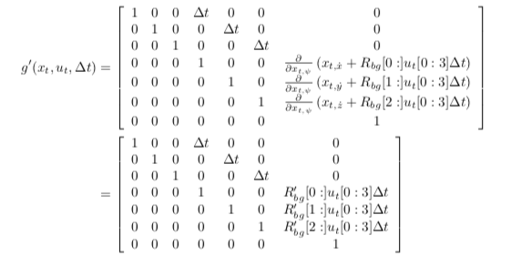
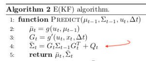
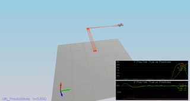

[](https://www.udacity.com/course/flying-car-nanodegree--nd787)

# [Esitmation Project](https://github.com/scifiswapnil/Udacity-Autonomous-Flight-Engineer/tree/main/Esitmation-Project)

This is the Esitmation project submission

## **1:** Determine the standard deviation of the measurement noise of both GPS X data and Accelerometer X data. 

Obtain the GPS and Accelerometer data's standar deviation as follows: 
    - I took the data from `Graph1.txt` and `Graph2.txt` 
    - Imported it to MS Excel 
    - Extracted the standar devitiation using the **"STDEV"** function

```
MeasuredStdDev(GPSPosX) :   0.7661268261
MeasuredStdDev(AccelX)  :   0.4953691291

```
## **2.** Implement a better rate gyro attitude integration scheme in the UpdateFromIMU() function.

The purpose of this task is to find the estimated Pitch and Roll angles. We get the quaternion from the ready project implementation:

```
Quaternion<float> qt = Quaternion<float>::FromEuler123_RPY(rollEst, pitchEst, ekfState(6));

```
I used the built in integration method, which worked better. It is then used to get the predicted values from the quaternion:

```cpp
qt.IntegrateBodyRate(gyro, dtIMU);
qt.Roll()
qt.Pitch()
```
---


## **3:** Implement all of the elements of the prediction step for the estimator.

I created the `RGB'` matrix from the document:
```cpp
    float sinPhi = sin(roll);
    float cosPhi = cos(roll);
    float sinTheta = sin(pitch);
    float cosTheta = cos(pitch);
    float sinPsi = sin(yaw);
    float cosPsi = cos(yaw);
    
    RbgPrime(0, 0) = -cosTheta * sinPsi;
    RbgPrime(0, 1) = -sinPhi*sinTheta*sinPsi -cosTheta*cosPsi;
    RbgPrime(0, 1) = -cosPhi*sinTheta*sinPsi+sinPhi*cosPsi;
    
    RbgPrime(1, 0) = cosTheta * cosPsi;
    RbgPrime(1, 1) = sinPhi*sinTheta*cosPsi-cosPhi*sinPsi;
    RbgPrime(1, 2) = cosPhi*sinTheta*cosPsi+sinPhi*sinPsi;
```

G prime was calcuated with the following formula:   



The ` C++` code:

```cpp
  MatrixXf u(3,1);
  u(0,0) = accel.x*dt;
  u(1,0) = accel.y*dt;
  u(2,0) = accel.z*dt;
    
  MatrixXf m = RbgPrime * u;
    
  gPrime(0,3) = dt;
  gPrime(1,4) = dt;
  gPrime(2,5) = dt;

    
  gPrime(3,6) = m(0,0);
  gPrime(4,6) = m(1,0);
  gPrime(5,6) = m(2,0);
```

The updated (estimated) covariance was calculated from the equation:



```
ekfCov = gPrime*ekfCov*gPrime.transpose() + Q;
```

The `PredictState()` fuction makes a simple prediction by integrating the accelerations and velocities:

The `accel` input accelerations are in the body frames so we convert them to the inertial frame by using `attitude.Rotate_BtoI(accel)`.

Also, it is noted that we should account for gravity because it is not added to the values:

```
V3F att = attitude.Rotate_BtoI(accel) + V3F(0,0,-9.81f); /*The acceleration (accel) is without gravity*/
```

And simplistic integrations:

```
  predictedState(0) += ekfState(3)*dt;
  predictedState(1) += ekfState(4)*dt;
  predictedState(2) += ekfState(5)*dt;
  predictedState(3) += att.x*dt;
  predictedState(4) += att.y*dt;
  predictedState(5) += att.z*dt;
```

## **4.** Implement the magnetometer update.

The magnetometer update asks for the `hPrime` and  `z_t` (named `zFromX` in the project):

```
zFromX(0)=ekfState(6);
hPrime(0,6)=1 //(Eveything else is zeros)
```
and normalize the difference between the measured and estimated yaw:

```
    float d = z(0) - ekfState(6);
    if (d > F_PI) z(0) -= 2.f*F_PI;
    if (d < -F_PI) z(0) += 2.f*F_PI;
```

## **5.** Implement the GPS update.

In the `UpdateFromGPS` method we're asked to calculate `hPrime`.This was done with a simple for-loop:

```
    for (int i=0;i<6;i++){
        hPrime(i,i) = 1;
        zFromX(i) = ekfState(i);
    }
```

The estimated values were simple taken from `ekfState` as you can see above.

## **6.** Meet the performance criteria of each step.

The project passes all performance criteria.

## **7.** De-tune your controller to successfully fly the final desired box trajectory with your estimator and realistic sensors.

I used my controller from control project and gain values and managed to pass the performance criteria without any significant changes.

 
