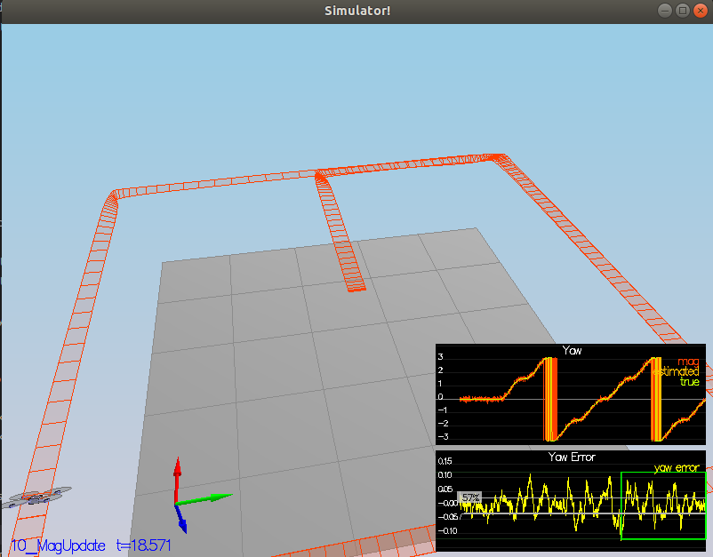

[](https://www.udacity.com/course/flying-car-nanodegree--nd787) **[Estimation Project](https://github.com/scifiswapnil/Udacity-Autonomous-Flight-Engineer/tree/main/Estimation-Project)**

This is the Estimation project submission and you are reading the writeup for the project.

Project Outline :

 - Step 1: Sensor Noise
 - Step 2: Attitude Estimation
 - Step 3: Prediction Step
 - Step 4: Magnetometer Update
 - Step 5: Closed Loop + GPS Update
 - Step 6: Adding Your Controller


---

## **1:** Sensor Noise.

#### A) Obtain the GPS and Accelerometer data's standar deviation as follows: 

- I took the data from `Graph1.txt` and `Graph2.txt` 
- Imported it to MS Excel 
- Extracted the standar devitiation using the **"STDEV"** function

#### B) Following results were obtained and plugged in the "06_SensorNoise.txt"

```
stdDev(Accel-X) :   0.7116903005
stdDev(GPS-X)   :   0.4865793498
```

#### C) Results:

```
Simulation #2 (../config/06_SensorNoise.txt)
PASS: ABS(Quad.GPS.X-Quad.Pos.X) was less than MeasuredStdDev_GPSPosXY for 71% of the time
PASS: ABS(Quad.IMU.AX-0.000000) was less than MeasuredStdDev_AccelXY for 67% of the time
```
---

## **2:** Attitude Estimation

Here we need to implement a better rate gyro attitude integration scheme. The linear scheme is already provided, so here a non-linear scheme is implemented, based on one of the control lectures. The derivates of the roll,pitch and yaw are calculated using the equations as below and then we mulitple them by `dt` to approixamte the angle :


#### A) Code 

```cpp
  Mat3x3F rotMat;
  rotMat(0,0) = 1;
  rotMat(0,1) = sin(rollEst) * tan(pitchEst);
  rotMat(0,2) = cos(rollEst) * tan(pitchEst);
  rotMat(1,0) = 0;
  rotMat(1,1) = cos(rollEst);
  rotMat(1,2) = -sin(rollEst);
  rotMat(2,0) = 0;
  rotMat(2,1) = sin(rollEst) / cos(pitchEst);
  rotMat(2,2) = cos(rollEst) / cos(pitchEst);

  V3F angle_dot = rotMat * gyro;

  float predictedRoll = rollEst + dtIMU * angle_dot.x;
  float predictedPitch = pitchEst + dtIMU * angle_dot.y;
  ekfState(6) = ekfState(6) + dtIMU * angle_dot.z;
```
After updating the above code, in the `QuadEstimatorEKF.cpp`, the following successful results we obtained. 


#### B) Results 

```
Simulation #2 (../config/07_AttitudeEstimation.txt)
PASS: ABS(Quad.Est.E.MaxEuler) was less than 0.100000 for at least 3.000000 seconds
```

---

## **3:** Prediction Step

This task is divided into two parts, first where the state is predicted using acceleration data and second where the covariance matrix and the EKF step is implemented. 

#### TASK 1 : 

After implementation of the first step following results were obtained. 


#### TASK 2 :

Using the reference paper provided by the Udacity program here [Estimation for Quadrotors](https://www.overleaf.com/read/vymfngphcccj#/54894644/), from `7.2 Transition Model` the covariance matrix is implemented and EKF state is finished. Following were the results obtained


---

## **4:** Magnetometer Update

Here the `updateFromMag()` function is implemented to improve the filter's performance for estimating the vehicle headings. Using the reference paper provided by the Udacity program here [Estimation for Quadrotors](https://www.overleaf.com/read/vymfngphcccj#/54894644/) from section `7.3.2 Magnetometer`, we implemented the equations for the task. 



#### Results 

```
Simulation #2 (../config/10_MagUpdate.txt)
PASS: ABS(Quad.Est.E.Yaw) was less than 0.120000 for at least 10.000000 seconds
PASS: ABS(Quad.Est.E.Yaw-0.000000) was less than Quad.Est.S.Yaw for 57% of the time
```

---

## **5:** Closed Loop + GPS Update

Using the reference paper provided by the Udacity program here [Estimation for Quadrotors](https://www.overleaf.com/read/vymfngphcccj#/54894644/) from section `7.3.1 GPS`, we implemented the equations for the task. 


#### Results 

```
Simulation #2 (../config/11_GPSUpdate.txt)
PASS: ABS(Quad.Est.E.Pos) was less than 1.000000 for at least 20.000000 seconds
```

---

## **6:** Adding Your Controller

Placed the controller and parameters from the previous submission to check the behaviour of the quadcopter.


```
Simulation #1 (../config/11_GPSUpdate.txt)
PASS: ABS(Quad.Est.E.Pos) was less than 1.000000 for at least 20.000000 seconds
```

---
